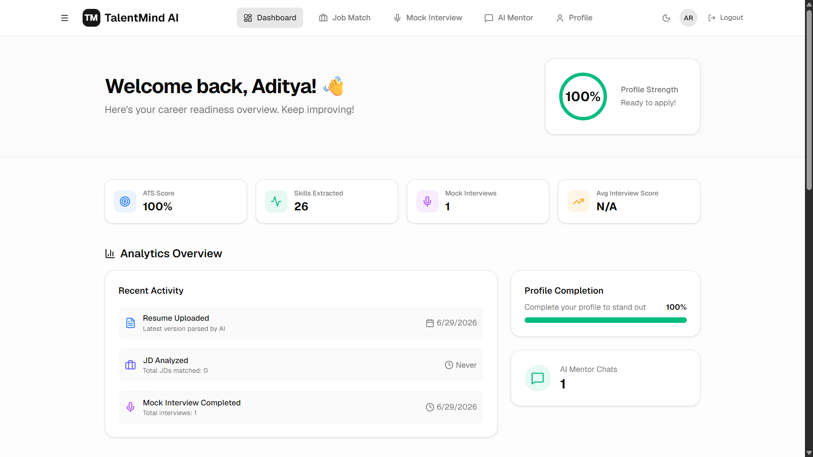
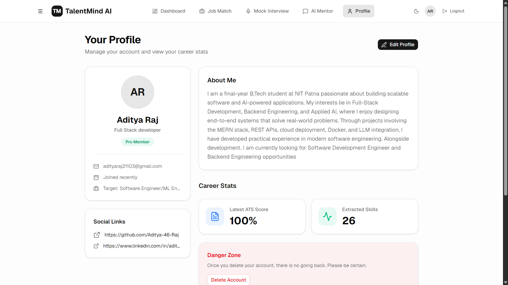
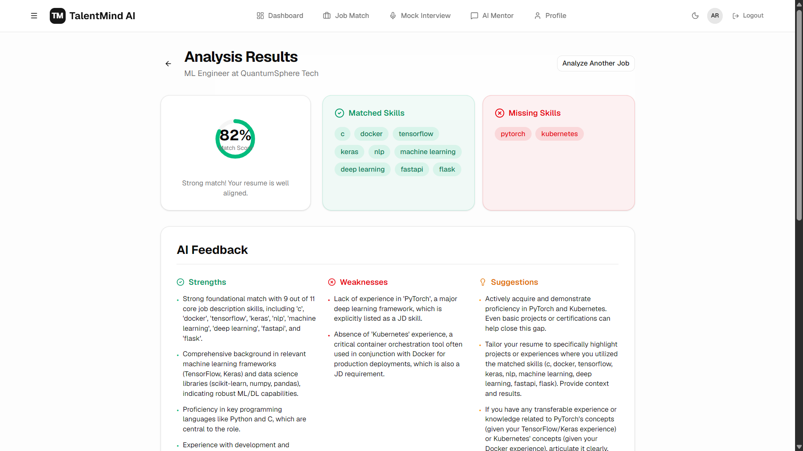
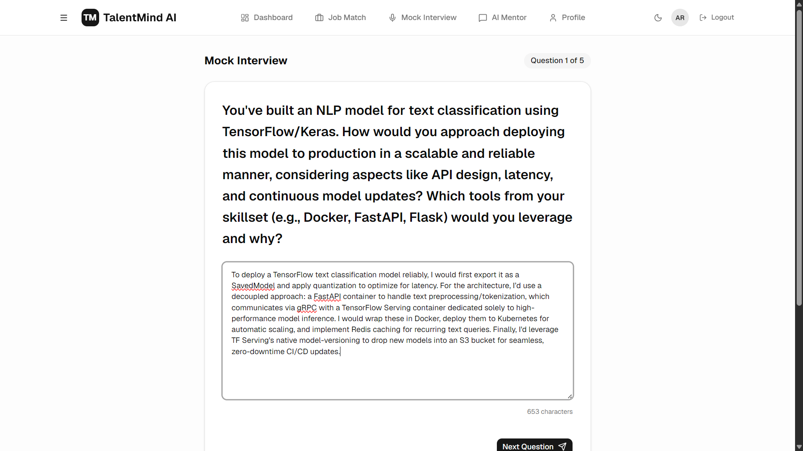
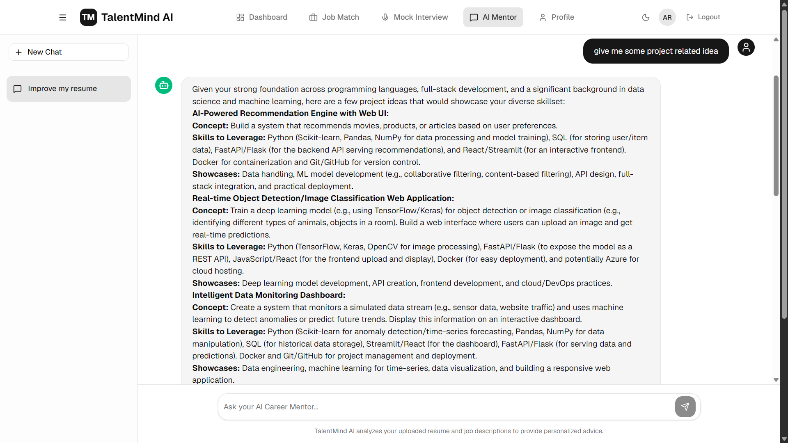
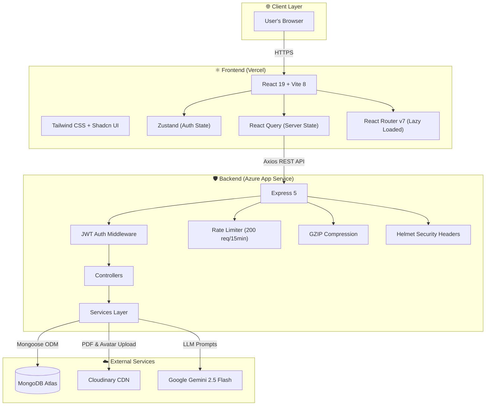

<div align="center">

# 🧠 TalentMind AI

### Your AI-Powered Career Intelligence Platform

*From Resume Upload to Interview Mastery — All in One Place*

<br>

[](https://reactjs.org/)
[](https://vitejs.dev/)
[](https://nodejs.org/)
[](https://expressjs.com/)
[](https://mongodb.com/)
[](https://deepmind.google/technologies/gemini/)
[](https://docker.com/)
[](./LICENSE)

<br>

[](https://talentmind-ai-adi.vercel.app)&nbsp;&nbsp;
[](https://talentmind-ai.azurewebsites.net/)&nbsp;&nbsp;
[](https://github.com/Aditya-46-Raj/TalentMind-AI/issues)

</div>

---

## 📖 About The Project

**TalentMind AI** is a full-stack career acceleration platform that uses **Google's Gemini 2.5 Flash** LLM to give candidates a genuine competitive edge. It's not just another chatbot — it's an integrated system where every feature is aware of the user's resume, target job, and career profile.

Upload your PDF resume. Paste a job description. Watch the AI parse your skills, calculate an ATS compatibility score, identify your skill gaps, generate targeted mock interview questions, evaluate your answers on a strict 100-point rubric, and build you a personalized 30-day improvement plan.

### 🎯 The Problem It Solves

| Traditional Approach | TalentMind AI |
| :--- | :--- |
| Generic interview prep resources | Questions generated from *your* resume gaps |
| Manual resume reviews | Automated ATS scoring with structural feedback |
| No visibility into skill gaps | Side-by-side skill matching against real JDs |
| Scattered learning resources | One platform: Upload → Analyze → Practice → Improve |

---

## ✨ Core Features

### 🖥️ Premium Dashboard & UI
A modern, responsive interface built with **Tailwind CSS v4**, **Shadcn UI**, and **Lucide React** icons. Features include:
- 🌓 **Dark/Light Mode** toggle (synced to `localStorage`)
- 📊 **Analytics cards** showing profile completion, resumes uploaded, interviews completed
- ⏳ **Skeleton loaders** on all major pages for a premium loading feel
- 🧭 **Collapsible sidebar** with quick navigation
- 🔔 **Global error handling** with toast notifications for network errors, 401s, 403s, and 500s





---

### 📄 Smart Resume Analysis
Upload your PDF resume. The backend uses `pdf-parse` to extract raw text, runs it through a custom ATS scoring engine (checking for contact info, education, experience, projects, and skill density), and then sends it to **Gemini AI** for deep analysis — returning strengths, weaknesses, and actionable suggestions.

---

### 🎯 Job Description Matcher
Paste any job description. The system extracts the required skills from the JD, compares them against your resume skills, and computes a **Match Score**. Gemini AI then explains why you're a good (or bad) fit, and generates a learning roadmap to close the gaps.



---

### 🤖 AI Mock Interview Simulator
Configure your interview by selecting a **target role**, **company name**, and **difficulty level** (Beginner → Expert). The AI reads your actual resume skills and missing JD skills from the database to dynamically generate 5-7 highly relevant questions mixing Technical, Behavioral, and Project-based categories. After you answer each question, the AI evaluates your entire session on a **100-point rubric**:

| Rubric Category | Max Points |
| :--- | :---: |
| Technical Accuracy | 40 |
| Communication | 20 |
| Problem Solving | 20 |
| Project Knowledge | 20 |

The final report includes a detailed **30-Day Improvement Plan** with topics to study, projects to build, and curated learning resources.



---

### 💬 Context-Aware Career Chatbot
Not just a generic AI chat. The chatbot receives your **full profile**, **latest resume analysis**, and **latest JD analysis** as context with every message. Ask it for cover letter drafts, salary negotiation advice, or project ideas — and it responds with answers tailored specifically to *your* career situation.



---

## 🏗️ System Architecture



---

## 📡 API Reference

All endpoints are prefixed with `/api`. Authentication uses JWT Bearer tokens.

| Method | Endpoint | Description | Auth |
| :---: | :--- | :--- | :---: |
| `POST` | `/api/auth/register` | Create a new user account | ❌ |
| `POST` | `/api/auth/login` | Login and receive JWT token | ❌ |
| `GET` | `/api/auth/me` | Get current authenticated user | ✅ |
| `GET` | `/api/profile` | Fetch user profile | ✅ |
| `PUT` | `/api/profile` | Update user profile (with avatar) | ✅ |
| `POST` | `/api/resume/upload` | Upload and analyze a PDF resume | ✅ |
| `GET` | `/api/resume/latest` | Get the latest resume analysis | ✅ |
| `POST` | `/api/job/analyze` | Analyze a pasted job description | ✅ |
| `GET` | `/api/job/:id` | Get a specific JD analysis result | ✅ |
| `POST` | `/api/chat` | Start a new chat conversation | ✅ |
| `GET` | `/api/chat` | List all chat sessions | ✅ |
| `POST` | `/api/chat/:id/message` | Send a message in a chat | ✅ |
| `POST` | `/api/interview/start` | Start a new mock interview session | ✅ |
| `POST` | `/api/interview/:id/submit` | Submit answers and get evaluation | ✅ |
| `GET` | `/api/interview/:id/report` | Get the interview report | ✅ |
| `GET` | `/api/health` | Server health check | ❌ |

---

## 🛠️ Technology Stack

| Layer | Technologies |
| :--- | :--- |
| **Frontend** | React 19, Vite 8, Tailwind CSS v4, Zustand, TanStack React Query, React Router v7, Radix UI, Shadcn UI, Lucide Icons, React Markdown, React Hook Form + Zod |
| **Backend** | Node.js 18+, Express.js v5, Mongoose 9, JWT (jsonwebtoken), Helmet, Express Rate Limit, Compression, Morgan, Multer, pdf-parse, Nodemailer |
| **Database** | MongoDB Atlas (Mongoose ODM) |
| **AI Engine** | Google GenAI SDK — Gemini 2.5 Flash (structured JSON output) |
| **File Storage** | Cloudinary (PDF resumes, user avatars) |
| **DevOps** | Docker (multi-stage builds), Nginx, docker-compose, Azure App Service (web.config), Vercel (vercel.json) |

---

## 📂 Project Structure

```
TalentMind-AI/
│
├── backend/                          # Express.js REST API
│   ├── src/
│   │   ├── config/                   # DB, Cloudinary, Gemini initialization
│   │   │   ├── db.js                 # MongoDB connection
│   │   │   ├── cloudinary.js         # Cloudinary setup
│   │   │   └── gemini.js             # Google GenAI client
│   │   ├── constants/                # Skill dictionary for ATS matching
│   │   ├── controllers/              # Request handlers
│   │   │   ├── auth.controller.js
│   │   │   ├── chat.controller.js
│   │   │   ├── interview.controller.js
│   │   │   ├── job.controller.js
│   │   │   ├── profile.controller.js
│   │   │   └── resume.controller.js
│   │   ├── errors/                   # Custom error classes
│   │   ├── middleware/               # Auth (JWT) & file upload (Multer)
│   │   ├── models/                   # Mongoose schemas
│   │   │   ├── User.js
│   │   │   ├── Profile.js
│   │   │   ├── Resume.js
│   │   │   ├── JobAnalysis.js
│   │   │   ├── Chat.js
│   │   │   └── InterviewSession.js
│   │   ├── routes/                   # Express route definitions
│   │   ├── services/                 # Business logic
│   │   │   ├── ats.service.js        # Skill extraction & ATS scoring
│   │   │   ├── gemini.service.js     # All Gemini AI prompts
│   │   │   ├── job.service.js        # JD skill matching
│   │   │   └── resume.service.js     # PDF text extraction
│   │   ├── utils/                    # Helpers
│   │   ├── validators/               # Zod request validation
│   │   └── app.js                    # Express app configuration
│   ├── server.js                     # Entry point
│   ├── Dockerfile                    # Production container
│   ├── web.config                    # Azure IISNode config
│   └── .env.example                  # Environment variable template
│
├── frontend/                         # React SPA
│   ├── src/
│   │   ├── components/
│   │   │   ├── common/               # Shared components
│   │   │   ├── layout/               # MainLayout, AuthLayout, Sidebar, Footer
│   │   │   └── ui/                   # Shadcn primitives (Button, Card, Input, Skeleton, etc.)
│   │   ├── features/                 # Feature-based architecture
│   │   │   ├── auth/                 # Login, Register, Auth Store
│   │   │   ├── chat/                 # AI Career Chat
│   │   │   ├── dashboard/            # Analytics & Quick Actions
│   │   │   ├── interview/            # Setup, Session, Report pages
│   │   │   ├── job/                  # JD Input & Analysis Results
│   │   │   ├── profile/              # Profile view & edit
│   │   │   ├── resume/               # Resume upload services
│   │   │   └── settings/             # App settings & theme
│   │   ├── lib/                      # Axios instance with interceptors
│   │   └── routes/                   # React Router config (lazy loaded)
│   ├── Dockerfile                    # Multi-stage: Node build → Nginx serve
│   ├── nginx.conf                    # SPA routing for Docker
│   ├── vercel.json                   # SPA rewrites for Vercel
│   └── .env.example                  # Environment variable template
│
├── docker-compose.yml                # Full-stack orchestration
├── LICENSE                           # MIT License
└── README.md                         # You are here
```

---

## 🚀 Getting Started

### Prerequisites

- **Node.js** v18 or higher ([Download](https://nodejs.org/))
- **MongoDB** connection string ([MongoDB Atlas — Free Tier](https://www.mongodb.com/atlas))
- **Gemini API Key** ([Google AI Studio](https://aistudio.google.com/apikey))
- **Cloudinary** account ([Sign Up](https://cloudinary.com/))

### 1. Clone the Repository

```bash
git clone https://github.com/Aditya-46-Raj/TalentMind-AI.git
cd TalentMind-AI
```

### 2. Configure Environment Variables

**Backend** — Create `backend/.env` from the template:

```env
PORT=5000
NODE_ENV=development
MONGO_URI=your_mongodb_connection_string
CLIENT_URL=http://localhost:5173
JWT_SECRET=your_jwt_secret_key
JWT_EXPIRES_IN=7d
CLOUDINARY_CLOUD_NAME=your_cloud_name
CLOUDINARY_API_KEY=your_api_key
CLOUDINARY_API_SECRET=your_api_secret
GEMINI_API_KEY=your_gemini_api_key
```

**Frontend** — Create `frontend/.env` from the template:

```env
VITE_API_URL=http://localhost:5000/api
```

### 3. Run Locally

Open two terminal windows:

```bash
# Terminal 1 — Backend
cd backend
npm install
npm run dev        # Starts with nodemon on port 5000
```

```bash
# Terminal 2 — Frontend
cd frontend
npm install
npm run dev        # Starts Vite dev server on port 5173
```

Open your browser at **http://localhost:5173**

### 4. Run with Docker (Alternative)

If you have **Docker Desktop** installed, spin up the entire stack with one command:

```bash
# Create a .env file at the root with your secrets, then:
docker-compose up --build
```

| Service | URL |
| :--- | :--- |
| Frontend | `http://localhost:8080` |
| Backend | `http://localhost:5000` |
| Health Check | `http://localhost:5000/api/health` |

---

## ☁️ Deployment Architecture

| Component | Platform | Why |
| :--- | :--- | :--- |
| Frontend | **Vercel** | Automatic Vite builds, global CDN, instant preview deployments |
| Backend | **Azure App Service** | Enterprise-grade Node.js hosting, demonstrates cloud skills |
| Database | **MongoDB Atlas** | Managed, scalable, free-tier available |
| File Storage | **Cloudinary** | Optimized image/PDF delivery with transformations |
| AI Engine | **Google Gemini** | State-of-the-art LLM with structured JSON output |

### Production Hardening Included

- ✅ **Rate Limiting** — 200 requests per IP per 15 minutes
- ✅ **GZIP Compression** — Reduced API payload sizes
- ✅ **Helmet** — Secure HTTP headers
- ✅ **Trust Proxy** — Correct IP detection behind reverse proxies
- ✅ **Lazy Loading** — Route-level code splitting for faster initial load
- ✅ **Health Endpoint** — `/api/health` for uptime monitoring
- ✅ **SEO Meta Tags** — Open Graph & Twitter Card support


## 🤝 Contributing

Contributions, issues, and feature requests are welcome! Feel free to check the [issues page](https://github.com/Aditya-46-Raj/TalentMind-AI/issues).

1. Fork the project
2. Create your feature branch (`git checkout -b feature/amazing-feature`)
3. Commit your changes (`git commit -m 'Add amazing feature'`)
4. Push to the branch (`git push origin feature/amazing-feature`)
5. Open a Pull Request

---

## 📄 License

Distributed under the **MIT License**. See [`LICENSE`](./LICENSE) for more information.

---

<div align="center">

### Built with ❤️ by [Aditya Raj](https://github.com/Aditya-46-Raj)

⭐ **Star this repo if you found it helpful!** ⭐

</div>
